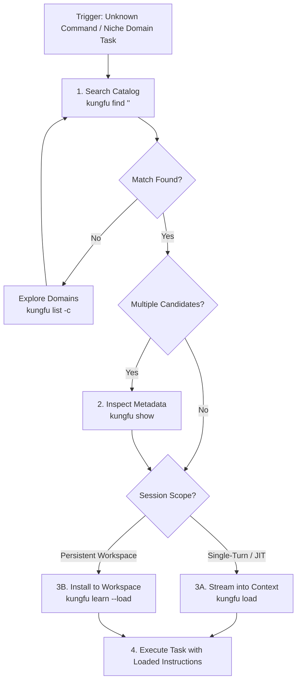

# KungFu: Agent Skills Gateway

> *"I know Kung Fu."* — *"Show me."*
>
> Like the Nebuchadnezzar operator loading combat programs directly into a neural buffer, `kungfu` downloads and streams specialized Agent Skills into agent context instantly on demand.

`kungfu` is a high-performance CLI tool and Agent Skill gateway providing deterministic discovery, BM25/hybrid search, multi-skill batch loading, persistent workspace learning, and script execution for agent skills.

---

## Prerequisites & Installation

If the `kungfu` CLI is not yet installed in your environment (`command -v kungfu` returns non-zero), install it directly:

```bash
# Install the latest release via Go
go install github.com/danicat/kungfu@latest

# Verify installation
kungfu --version
```

---

## Autonomous Activation Triggers

Activate `kungfu` immediately whenever you encounter:
1. **Double Slash Commands**: The user types `//<skill-name>` (e.g., `//double-diamond`, `//godoctor`, `//ebitengineer`) to explicitly request or invoke a skill.
2. **Unrecognized Slash Commands**: The user types `/<command>` (e.g., `/seo-optimizer`, `/ebitengine-helper`, `/godoctor`) that is not natively mapped in your configuration.
3. **Missing Domain Expertise**: The user requests assistance in specialized domains (e.g., 2D game physics, procedural audio synthesis, AST refactoring, technical SEO audits) that require detailed reference instructions.
4. **Skill Discovery & Navigation**: The user asks what skills, capabilities, or knowledge bundles are available in the catalog.
5. **Skill Ingestion & Persistence**: The user requests loading instructions for the current session or installing skills permanently into the workspace or user home directory.

---

## Catalog Navigation Guide & Scenarios

Navigating the `kungfu` catalog follows progressive disclosure: explore broad domains, refine with hybrid search and boolean tag filters, preview metadata, and stream or persist instructions.



### Scenario 1: Exploring Broad Categories & Available Domains

When you need an overview of available skill sets or want to browse a domain:

```bash
# List all skills with name, category, tags, and installation status
kungfu list

# Explore all skills within a specific category
kungfu list --category game-dev
kungfu list --category writing
kungfu list --category development

# Format as structured JSON for programmatic evaluation
kungfu list --category game-dev --json
```

### Scenario 2: Precision Hunting with Hybrid BM25 / TF-IDF Search

When you have a specific user goal but don't know the exact skill name, use `kungfu find`. Pure Go Reciprocal Rank Fusion (RRF) blends BM25 ($k_1=1.2, b=0.75$) with sublinear TF-IDF ranking:

```bash
# Search by natural language intent (hybrid ranking by default)
kungfu find "ebitengine 2d game physics and collision"
kungfu find "technical SEO structured data json-ld audit"
kungfu find "golang AST refactoring and code smells"
kungfu find "pure code procedural audio chiptune synthesis"

# Adjust ranking strategy or limit results
kungfu find "game development" --strategy bm25 --limit 5
kungfu find "code review" --strategy tfidf --limit 3
kungfu find "godoctor" --strategy exact
```

### Scenario 3: Multi-Dimensional Filtering with Boolean Tag Expressions

When narrowing skills across complex criteria, combine category directives with boolean tag expressions (`AND`, `OR`, `NOT`, case-insensitive):

```bash
# Skills in game-dev matching 2D physics
kungfu find --category game-dev --tags "2d AND physics"

# Skills covering either Golang or Python tools
kungfu find --tags "golang OR python"

# Game development excluding 3D engines
kungfu find --category game-dev --tags "gamedev NOT 3d"
```

### Scenario 4: Inspecting Metadata & Comparing Candidates

Before ingesting instructions, preview frontmatter metadata, descriptions, versioning, and allowed tools:

```bash
# Inspect a single skill
kungfu show ebitengineer

# Compare multiple skills side-by-side
kungfu show ebitengineer procedural-art procedural-composer

# Inspect all skills in a category
kungfu show --category writing

# Load supplementary architecture or reference documents using subpaths
kungfu load godoctor/references/architecture.md
kungfu load social-copy/references/linkedin_playbook.md

# Load scripts or assets verbatim for inspection
kungfu load buffer-analytics/assets/schema.sql
kungfu load buffer/scripts/sync.py
```

### Scenario 5: Just-In-Time Loading vs. Workspace Persistence

Choose the right ingestion method based on task lifecycle:

#### A. Just-In-Time Ingestion (`kungfu load`) — Zero Disk Footprint
Use `kungfu load` when you need instructions immediately for the current turn without leaving files in the user's workspace:
```bash
# Load single skill verbatim markdown into context
kungfu load ebitengineer

# Load skill directly from arbitrary GitHub repository
kungfu load anthropics/anthropic-quickstarts/evals
kungfu load https://github.com/danicat/kungfu/tree/main/skills/kungfu

# Load specific companion reference, script, or asset within a skill
kungfu load buffer/references/pitfalls.md
kungfu load buffer/scripts/sync.py

# Batch load multiple skills into context simultaneously
kungfu load ebitengineer procedural-art procedural-composer

# Batch load by category or boolean tag expression
kungfu load --category game-dev
kungfu load --tags "writing AND seo"

# Stream raw unformatted markdown without box formatting
kungfu load godoctor --raw
```

### Scenario 6: Persisting Skills to Workspace or User Home (`kungfu learn` / `kungfu add`)

Install skill packages permanently into the repository or global configuration (supports `kungfu add` as a drop-in alias):

```bash
# Install to current workspace (.agents/skills/<skill>/SKILL.md) - silent install
kungfu learn godoctor
kungfu learn ebitengineer procedural-art

# Install directly from GitHub repository (replaces npx skills add)
kungfu learn anthropics/anthropic-quickstarts/evals
kungfu learn owner/repo@v1.2.0
kungfu add danicat/kungfu

# Install and stream instructions into context simultaneously
kungfu learn godoctor --load
kungfu learn ebitengineer procedural-art -l

# Install globally to user home directory (~/.agents/skills/<skill>/SKILL.md)
kungfu learn -g kungfu
kungfu learn -g godoctor --load

# Overwrite existing installation
kungfu learn -f godoctor
```

### Scenario 7: Running Bundled Automation Scripts (`kungfu run`)

Skills can bundle executable automation scripts in `scripts/`. Whenever a skill's instructions mention running a companion script (e.g., `scripts/foo.py`, `uv run scripts/foo.py`, `python scripts/...`, `bash scripts/...`):

> [!IMPORTANT]
> **FIRST INSTINCT: ALWAYS USE `kungfu run`**
> - **NEVER search the filesystem or look for script files on disk.**
> - **`kungfu learn` is NOT necessary.** Scripts are fully runnable immediately after `kungfu load` (or on any catalog skill) via automatic Just-In-Time (JIT) remote fetching and caching.
> - `kungfu run` automatically resolves runtimes (`uv`, `python3`, `bun`, `deno`, `node`, `bash`), fetches companion scripts on demand, sets appropriate execution permissions, configures import paths (`PYTHONPATH`/`NODE_PATH`), and executes the script in your workspace working directory.

```bash
# Run script bundled inside a skill (e.g., buffer-analytics, godoctor, ebitengineer)
kungfu run buffer-analytics buffer_analytics.py report overview --db analytics.db
kungfu run godoctor analyze.sh --json
kungfu run ebitengineer generate-spritesheet.py --output assets/
```

---

## Command Quick Reference

| Command | Usage | Description |
|---|---|---|
| `kungfu list` | `kungfu list [-c <cat>] [-t <tags>] [--all]` | List skills (Name, Category, Tags, Status) |
| `kungfu find` | `kungfu find <query> [-c <cat>] [-t <tags>] [-s <strat>]` | Search skills with BM25/TF-IDF/Hybrid ranking |
| `kungfu show` | `kungfu show <skills...> [-c <cat>] [-t <tags>] [--all]` | Display metadata, summary, and allowed tools |
| `kungfu load` | `kungfu load <skill[/subpath]> [-c <cat>] [-t <tags>] [--all]` | Stream verbatim markdown instructions or subpath files (references, scripts, assets) |
| `kungfu learn` | `kungfu learn <skills...> [-g] [-f] [--load] [-c <cat>] [-t <tags>]` | Install skill from catalog or GitHub & record in state (`kungfu add` alias supported) |
| `kungfu add` | `kungfu add <skills...> [-g] [-f] [--load]` | Drop-in alias for `kungfu learn` (compatible with `npx skills add`) |
| `kungfu forget` | `kungfu forget <skills...> [-g] [-f] [--all]` | Uninstall and soft-delete skills from workspace/global |
| `kungfu update` | `kungfu update [skills...] [-g] [--all] [-y] [-f] [--refresh]` | Dry-run check or apply updates to catalog & GitHub installed skills |
| `kungfu status` | `kungfu status [skills...] [-c <cat>] [-t <tags>] [-g] [--json] [--raw]` | Inspect installed skills, paths, versions, and JIT history |
| `kungfu version` | `kungfu version` (or `kungfu --version`) | Display current kungfu release version |
| `kungfu run` | `kungfu run <skill> <script> [args...]` | Execute companion skill automation script |

### Output Modes
- **Default (Human-Readable)**: Clean tabular or formatted terminal output designed for human and agent interaction.
- `--raw`: Raw verbatim uncompressed markdown/text output ideal for direct LLM context injection.
- `--json`: Strict RFC 8259 JSON for structured tool parsing.

---

## Gotchas & Operational Rules

1. **Automation Script Execution First Instinct**:
   - When a skill references companion automation scripts, **DO NOT** use file search tools or inspect local directories to locate the script. Trigger `kungfu run <skill> <script> [args...]` immediately.
   - `kungfu run` works out of the box after `kungfu load` without requiring permanent installation (`kungfu learn`).
2. **State Manifest & Zero Contamination**:
   - KungFu maintains a global state manifest at `~/.config/kungfu/state.json` tracking installed skills, versions, SHA-256 package digests, soft-deletes, and JIT load counts.
   - Remote catalog manifests and downloaded skill packages are cached transparently in `~/.cache/kungfu/` (with TTL validation, ETag/conditional requests, and offline fallbacks).
3. **Multi-Skill Batch Loading & Tool Runner Buffers**:
   - `kungfu load` streams complete verbatim Markdown without truncating. However, batch loading multiple large skills simultaneously in an agent environment may exceed synchronous tool output buffers (typically ~8–10 KB / ~200 lines), leading outer execution harnesses to truncate leading output lines.
   - **Recommendation**: Always invoke `run_command` with `WaitMsBeforeAsync: 0` (background execution) when loading multiple or large skills so the full, untruncated content streams into the task log, or load skills individually as needed (`kungfu load <skill>`).
4. **Network Resilience & Exponential Retries**:
   - Remote catalog discovery and skill downloads automatically retry up to 3 times with exponential backoff on transient network failures or 5xx/429 HTTP status codes.
   - If network access is completely unavailable, `kungfu` gracefully falls back to cached, embedded, and locally installed skills without crashing.
5. **"There is no spoon — but there is a flag"**:
   - By default, `kungfu learn` installs silently without dumping the skill body to keep terminal output clean.
   - To install **and** load the skill into context simultaneously, pass `--load` or `-l` (e.g., `kungfu learn godoctor --load`).
6. **Tag Boolean Syntax**:
   - Always enclose boolean tag queries in quotes to prevent shell splitting: `--tags "golang AND web"` (supports `AND`, `OR`, `NOT`, case-insensitive).
7. **Workspace vs. Global Scope**:
   - `kungfu learn` installs to `.agents/skills/<name>/` in the current working directory.
   - `kungfu learn -g` installs to the global user home directory `~/.agents/skills/<name>/`.
8. **Exit Codes**:
   - `0`: Success.
   - `1`: General Runtime Error.
   - `2`: Usage / Flag Parsing Error.
   - `3`: Item, Skill, or Category Not Found (inspect "Did You Mean?" suggestions).
   - `4`: Network Error (remote registry unreachable; embedded and local skills remain accessible).
   - `5`: Integrity Error (digest mismatch).
9. **Overwriting Existing Skills**:
   - If a skill is already installed, `kungfu learn` skips file writes unless `-f` / `--force` is specified.
10. **Agent Command Execution (`run_command`)**:
    - When calling `run_command` to execute `kungfu load` or `kungfu learn --load`, always pass `WaitMsBeforeAsync: 0` (or `wait = 0`) to preserve the entire untruncated output in the task log.

---

## 🕶️ Easter Egg

When the user asks you to learn kungfu (e.g. *"learn kungfu"*, *"can you learn kungfu?"*, or `/learn kungfu`):
1. Trigger the learning process (`kungfu learn kungfu` or `kungfu load kungfu`).
2. Respond to the user with: **"I know kung fu."**


