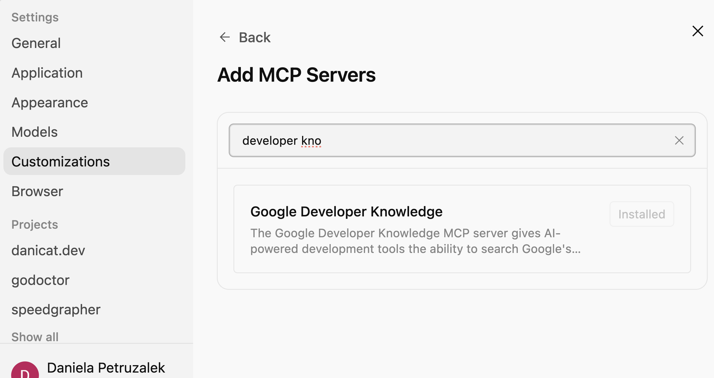

## Agent Skills para Google Cloud

Via Vercel skills CLI:

```sh
npx skills add google/skills
```

Via kungfu CLI:
```
kungfu catalog add google/skills
```

## Developer Knowledge MCP

### Instalação Guiada

Abra o app do Antigravity 2.0 -> Settings -> Customizations e procure a seção MCP. Então clique no botão Add MCP para ver a tela abaixo:



Basta clicar no botão adicionar.

### Instalação Manual

Pré-requisitos: um projeto GCP e a gcloud CLI instalada.

1. Ative a [Developer Knowledge API](https://console.cloud.google.com/start/api?id=developerknowledge.googleapis.com) no Google Cloud Console.

2. Autentique com a Application Default Credentials (ADC) para o seu projeto:

```sh
gcloud auth application-default login --project=PROJECT_ID
```

3. Adicione o seguinte bloco em `.agents/mcp_config.json`, substituindo a string `PROJECT_ID` pelo seu verdadeiro identificador de projeto.

```json
    "google-developer-knowledge": {
      "httpUrl": "https://developerknowledge.googleapis.com/mcp",
      "authProviderType": "google_credentials",
      "oauth": {
        "scopes": [
          "https://www.googleapis.com/auth/cloud-platform"
        ]
      },
      "timeout": 30000,
      "headers": {
        "X-goog-user-project": "PROJECT_ID"
      }
    }
  }
```
